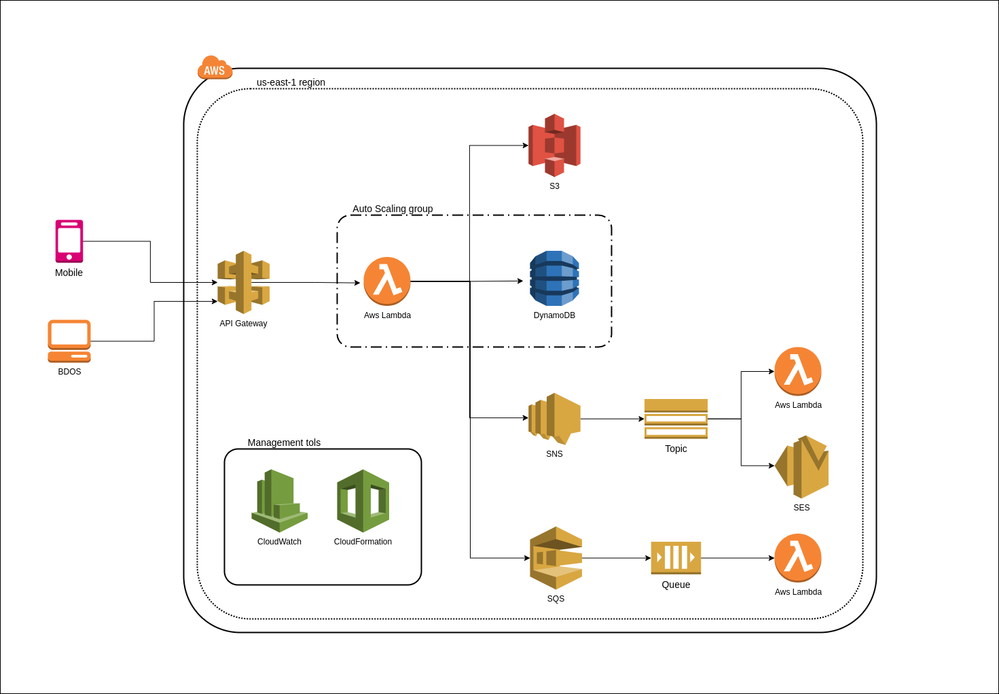

# aws-serverless-chat

A Chat using Aws Websocket, lambda and a React UI

## Sobre

Prova de conceito que consiste em fazer um sistema de mensageria (chat) através de um servidor serverless e um frontend em react.js;

## Video

- Check the app: [chat poc video](https://youtu.be/dEyua8kKb5g)

## Tecnlogias Frontend

**Linguagem**: Javascript (React.js)
 

## Depêndencias Backend

- Javascript (Node.js)
- Serverless Framework
- AWS services (Lambda, Api Gateway e DynamoDB)

 

## Arquitetura

## Execução do frontend

- É necessário instalação do [Npm](https://docs.npmjs.com/cli/install) e [Node](https://nodejs.org/en/download/)
- Instale as depêndencias `$ npm install`
- Inicie `$ npm start`

## Uso

A utilização do projeto requer poucos passos visando facilitar a correção do projeto. Após instalar as duas depêndencias

> 1 - Abra 2 abas e execute os passos a seguir em ambas

> 2 - Na tela incial, digite seu nome

> 3 - Na tela seguinte, digite as mensagens no campo "Enter message" e envie

> 4 - Em seguida, visualize que a mensagem foi distribuida entre as abas abertas

## Outros

O foco do projeto foi se ambientar com a tecnologia AWS Websockets para análise de viabilidade de um projeto maior à posteriori.
